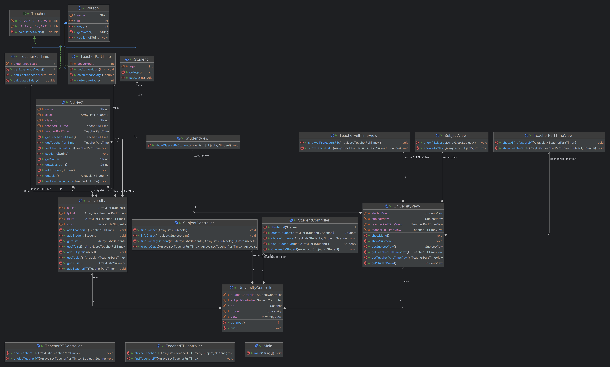

# Proyecto Final

El siguiente proyecto nos ayudará a poder tener un mejor seguimiento sobre las clases, los estudiantes y los profesores que tiene la universidad.

## Índice

- [Estructuración](#Estructuración)
- [Diagrama de clase](#diagrama-de-clase)
- [Estructura de paquetes](#estructura-de-paquetes)
  - [Paquete org.globant.model](#paquete-apporgglobantmodel)
  - [Paquete app.org.globant.model](#paquete-apporgglobantview)
  - [Paquete app.org.globant.controller](#paquete-apporgglobantcontroller)
  - [Main](#main)
- [Conclusión](#conclusión)

## Estructuración

Para este proyecto seguimos la arquitectura MVC para tener una mejor organización y poder separa la responsabilidad de cada componente en la aplicación. La estructura de paquetes es la siguiente:

- **Modelo**: El modelo se encuentra en la siguiente ruta `/app/org/globant/model`.
- **Controlador**: El controlador se encuentra en la siguiente ruta `/app/org/globant/controller`.
- **Vista**: La vista se encuentra en la siguiente ruta `/app/org/globant/view`.

En la parte del **Modelo** se colocó todas clases que se utilizarán para almacenar datos tanto de profesores, clases y alumnos dentro de la universidad.

En la **Vista** se coloca una clase para interactuar con el usuario de forma amigable por consola. Aquí se encuentra todo lo que el usuario ve en la consola.

Para el **Controlador** se creo un clase donde conecta el _Modelo_ y la _Vista_. Aquí se recibe las peticiones que envía el usuario por consola para luego comunicase con la _Vista_ y obtener información desde el _Modelo_.

## Diagrama de clase

Figura 1: Diagrama de clases del proyecto

## Estructura de paquetes

Para la estructura de paquetes tomamos como referencia `app.org.globant.*`. Donde **"\*"** son los paquetes para organizar la infraestructura MVC.

### Paquete app.org.globant.model

En este paquete se coloca las clases donde se obtiene la información y donde se almacena los datos. Para esto tenemos las siguientes clases.

- Person.java
- Student.java
- TeacherFullTime.java
- TeacherPartTime.java
- Subject.java
- University.java

La clase **_Person.java_** la usamos como una clase padre, donde tiene los atributos, métodos y constructores en común de los profesores y los alumnos. En este caso los atributos en común son el Id y el nombre y se utiliza el modificador de acceso `protected`.

Las clases **_Student.java_** , **_TeacherFullTime.java_** y **_TeacherPartTime.java_** heredan los atributos y los métodos que hay en la clase **_Person.java_**. Luego de que se hereda, se agrega los atributos específicos para cada clase hija. En el caso de **_Person_** se agrega el atributo **age** con modificador de acceso `private` para tener encapsulación de datos.

Mientras que en las clases de los profesores se agregan los atributos correspondientes. Estos son el salario base y dependiendo si es full time o part time se coloca los años de experiencia o las horas que va a trabajar. En el caso de estas clases se crea un método en especifico llamado `calculatedSalary` donde se calcula el salario dependiendo del tipo de profesor.

La clase **_Subject.java_** tiene sus atributos específicos y sus atributos de instanciación. Los atributos de instanciación nos ayuda a colocar un profesor especifico a la clase o materia y a añadir estudiantes a la clase o materia. El método especifico en esta ocasión es `addStudent` donde recibe como atributo un estudiante de tipo **Student** para luego añadir a la lista de estudiantes.

Para la clase **_University_** es la base del paquete model. Esta clase recibe toda la información que se recolecta de los estudiante, profesores y materias. Aquí se instancia listas de tipo **Student**, **Subject**, **TeacherFullTime** y **TeacherPartTime** para luego usarlas en los métodos donde se añada la información. Estos métodos son `addStudent`, `addSubject`, `addTeacherFT` y `AddTeacherPT` los cuales reciben como atributo el tipo de dato de cada objeto.

En esta clase también se implementa 2 métodos. El primero `findStudentById`el cual ayuda a buscar un estudiante por su _Id_ y dependiendo de ese Id retorna el estudiante correspondiente.
El segundo método `findClassByStudent` ayuda a encontrar todas materias en las cuales está registrado el estudiante. El método retorna una lista de tipo **Subject**.

### Paquete app.org.globant.view

El caso de este paquete solo tiene una clase la cual es **_UniversityView_**. Esta clase tiene todo lo que el usuario ve en la consola.
Debido que en esta clase se muestra el menú y se pide datos por consola se opta por instanciar la clase **Scanner**. Esta clase tiene métodos para mostrar información por consola como los siguientes métodos:

- `showMenu:` En este método se muestra el menú principal.
- `showSubMenu:` Ayuda a pedir una opción, en este caso una materia para obtener la información de esa materia.

- `getInput:` Este método sirve para guardar la opción que el usuario ingresa. Retorna un número de tipo int.

- `printAllProfessors:` Muestra la información de todos los profesores, tanto de full time como de part time.

- `printAllClases:` Imprime todas las clases que existen en la universidad. También sirve como un el sub-menú donde se elige una materia para obtener información.

- `printInfoClass:` Este método muestra la información de la materia, es un método `estático` para ser invocado solo con el nombre de la clase. Es método se ejecuta luego del método **printAllClases** y de **showSubMenu**.

- `createStudent:` No ayuda a solicitar la información del estudiante a registrar para luego retornar dicho estudiante.

- `choiceTeacher:` Ayuda a mostrar los profesores disponibles para poder elegir y luego registrarlo en una materia.

- `choiceStudent:` Ayuda a mostrar los estudiantes para asignarlos a la materia. Como se debe elegir algunos estudiantes se opta por preguntar si desea seguir añadiendo estudiantes.

- `createClass:` Crea la materia, en este método se llama a los métodos **choiceTeacher** y **choiceStudent**.

- `studentId:` Pide la información del Id del estudiante.

- `showClassesByStudent:` Sirve para mostrar todas las clases en las que un estudiante se encuentra registrado.

Todos estos métodos son utilizados en el controlador, donde se conecta con el modelo.

### Paquete app.org.globant.controller

Este paquete al igual que el paquete de view, solo tiene una sola clase `UniversityController`.

Este método es la conexión entre el modelo y la vista. Para esto se instancia tanto la clase **University**(modelo) y la clase **UniversityView**(vista).

Aquí solo hay un método especifico que se llama `run`. Este método nos ayuda a entregar información dependiendo de la opción del menú elegida por el usuario.

### Main

La clase `Main` no sabía donde colocarla, leí que va fuera de la aplicación así que no va dentro de un paquete. En esta clase se instancia las clases University model, view y controller. También, se inicializa los datos para los profesores, estudiantes y clases para luego ser guardados en su lista correspondiente y se llama al método `run` para iniciar el programa.

## Conclusión

En este proyecto nos ayuda mucho la infraestructura de **MVC** para tener un mejor orden y que cada paquete tenga su funcionalidad especifica. También se muestra los principios fundamentales de la programación orientada a objetos. Tales como representar clases con entidades del mundo real, implementación de herencia, polimorfismo, encapsulación, etc. Debido a esto se puede mostrar como la programación orientada a objetos nos ayuda a la organización, al mantenimiento y la reutilización de código.
